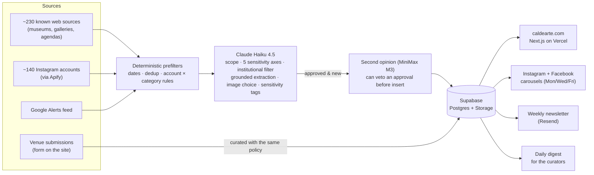

# Caldearte

**A free, curated calendar of contemporary art openings and exhibitions across Chile.**
Live at **[caldearte.com](https://www.caldearte.com)** · Instagram [@caldearte.oficial](https://www.instagram.com/caldearte.oficial/)

Caldearte finds visual-art exhibitions, openings and artistic interventions in all 16 regions of Chile. It curates them against an explicit editorial policy and publishes them as a calendar, a weekly newsletter, and Instagram and Facebook carousels. Almost all of this is automated: GitHub Actions run the pipelines, Claude does the reading and judging, and Supabase stores the result. Two human curators set the editorial line and review what the machine does.

The site and its content are in Chilean Spanish. This README, the code and most of the docs are in English.

---

## Contents

- [What makes it different](#what-makes-it-different)
- [How it works](#how-it-works)
- [Curation](#curation)
- [Lessons that shaped the design](#lessons-that-shaped-the-design)
- [Repository layout](#repository-layout)
- [Scheduled jobs](#scheduled-jobs)
- [Tech stack and costs](#tech-stack-and-costs)
- [Running it locally](#running-it-locally)
- [Documentation](#documentation)
- [Security](#security)
- [Contributing](#contributing)
- [License](#license)

---

## What makes it different

- **Curated, not aggregated.** Most candidates are rejected (about 9 out of 10 in a typical month). The editorial stance is part of the product: some themes are excluded unless an event takes an explicit critical position, and that rule is written down. See [Curation](#curation).
- **The whole run, with the opening as the highlight.** An exhibition stays listed from its first to its last day. When a source confirms a real opening night, that night is what gets highlighted.
- **Everywhere, not just the capital.** Big museums, small galleries, university spaces, community centers and street interventions share the same grid, across all 16 regions.
- **Cheap to run on purpose.** It runs on free tiers. The AI spend is about US$10 a month and is tracked call by call against a self-imposed ceiling.

## How it works



1. **Discovery.** Scheduled jobs fetch candidate events from known-rich web sources ("bright sources"), Instagram posts scraped through Apify, and a Google Alerts feed. Web sources with a stable structure use deterministic extractors. Everything else is read by the model.
2. **Prefiltering.** Cheap, deterministic rules run before any model call. They drop past events, known noise (per account and category) and exact duplicates, so the model only sees plausible candidates.
3. **Curation.** One non-agentic Claude Haiku 4.5 call per candidate decides `approved` or `rejected` against the written policy. The same call extracts dates, venue and artists, and it must quote the source verbatim for each, so nothing gets invented. It also picks the image and tags sensitive content.
4. **Safety net.** Before an approval is inserted, a second, stricter model reviews it. If it rejects the candidate on scope, the event is not inserted. Its only power is a veto: it can never approve anything on its own.
5. **Publishing.** Approved events land in Supabase. The site reads them through restricted public views. Separate jobs render branded flyers, publish carousels to Instagram and Facebook, and send the newsletter.
6. **Human loop.** An admin mode on the live site lets the curators remove an event (with a reason) or fix a sensitivity tag. Every correction is kept as an audit trail and feeds back into the policy.

## Curation

The full operational policy is in [`docs/curation-policy.md`](docs/curation-policy.md), and its prompt-facing version is in [`packages/curation-policy`](packages/curation-policy). In short:

- **Scope.** Visual-art exhibitions (painting, drawing, sculpture, printmaking, photography, installation and similar) and genuine artistic interventions, in a physical place in Chile.
  - Theater, concerts, circus, dance in its usual format, poetry readings, workshops and talks are out, even when the text calls them an "intervention" or an "experience". The test is the format, not the label.
  - Documentary or heritage displays (archive panels, scale models, record photographs) and online-only "exhibitions" are out too.
- **Five sensitivity axes, excluded by default:**
  - religion (including new religious movements);
  - war and violence (including police and military institutions);
  - the far right;
  - pseudoscience and superstition;
  - explicit physical or sexual aggression.

  An event on one of these axes is included only if it takes an explicit, unambiguous critical stance. Neutral documentation or "exploring the topic" does not qualify.
- **Institutional filter.** Places of worship, right-wing and far-right party headquarters, and police or military institutions are excluded as venues, whatever they show.
- **Sensitive but included.** Nudity, denunciations of violence, and memory and dictatorship themes stay in the calendar but are tagged. Their images are blurred by default, and a "family mode" hides them entirely.

These are editorial decisions made by the two curators. Changes to the policy require human review and are never made automatically.

## Lessons that shaped the design

Each of these came from a real incident, documented in [`docs/`](docs/):

- **Prompts don't fix scope-judgment failures; code does.** When the model kept reframing a circus act or a heritage display as "art", rewording the prompt didn't hold. What held were structural changes: verbatim-quote grounding for dates and places, an explicit anti-reframing rule, and a second model with veto power.
- **Ground everything that can be invented.** Early on, the model invented opening times and even whole events. Every extracted date, place and claim now has to be traceable to a quote from the source.
- **A second model works better as a veto than as a replacement.** The cheaper model was stricter, and often right, on scope. But it also dropped real events and ran ~13× slower, so it reviews approvals instead of making them.
- **Measure before building.** The general web-search pipeline cost real money and produced zero live events, so it was paused. Direct sources and Instagram cost cents and work. Elaborate infrastructure waits until usage data justifies it.
- **Free tiers have sharp edges.** One top-level `cookies()` read pushed the site to 94% of a monthly hosting limit. GitHub's scheduled workflows drift and sometimes don't fire, so a watchdog re-dispatches overdue jobs.

## Repository layout

| Path | What it is |
|---|---|
| [`apps/web`](apps/web) | The public site, admin mode and API routes (Next.js App Router, deployed on Vercel). Includes the flyer renderer used for social posts. |
| [`apps/curator`](apps/curator) | Every scheduled pipeline: event discovery (web, headless browser, Instagram, Google Alerts), social publishing, newsletter, daily digest, Instagram insights, Apify usage snapshots, and the weekly security audit. |
| [`packages/curation-policy`](packages/curation-policy) | The curation policy as code: prompt text, URL safety checks, the vision check. |
| [`packages/shared-types`](packages/shared-types) | Generated Supabase database types shared by both apps. |
| [`supabase/migrations`](supabase/migrations) | The database schema, including the seed of all 346 Chilean comunas. Every merge to `main` that touches this folder is applied to production by CI. |
| [`supabase/functions`](supabase/functions) | Edge Functions: newsletter confirm/unsubscribe, venue submissions, admin actions and analytics. |
| [`.github/workflows`](.github/workflows) | Cron jobs, the migration deploy, the cron watchdog and the security audit. |
| [`docs`](docs) | Design docs and decision logs (see [Documentation](#documentation)). |

## Scheduled jobs

All times are UTC (Chile is UTC−3 or UTC−4).

| Workflow | When | What it does |
|---|---|---|
| `event-discovery.yml` | Sun & Wed 06:07 | Bright-source discovery and curation |
| `headless-bright-sources.yml` | Sun & Wed 07:12 | Sources that need a real browser |
| `instagram-bright-sources.yml` | Mon–Sat 08:17 | Instagram discovery via Apify |
| `google-alerts-bright-source.yml` | Sun 09:22 | Google Alerts feed |
| `weekly-newsletter.yml` | Sun 10:27 | Weekly digest to subscribers, per region |
| `publish-social.yml` | Mon, Wed, Fri 12:05 | Instagram and Facebook carousels |
| `daily-digest.yml` | Daily 10:30 | Summary email for the curators |
| `apify-usage-snapshot.yml` | Daily 09:33 | Records Apify usage against the free tier |
| `instagram-insights.yml` | Mon 20:45 | Snapshot of the account's own metrics |
| `security-audit.yml` | Tue 13:20 | Secret/PII scan of tracked files + `pnpm audit` |
| `cron-watchdog.yml` | Every 4 h | Re-dispatches any of the above that is overdue |
| `deploy-migrations.yml` | On push to `main` | `supabase db push` to production when migrations change |

Minutes are off the hour on purpose: GitHub's scheduler is congested at `:00`.

## Tech stack and costs

- **Web:** Next.js 16 (App Router), React 19, Tailwind CSS 4, Auth.js (Google sign-in, admin only), on Vercel.
- **Data:** Supabase (Postgres, Storage, Edge Functions, row-level security). The public site only reads column-restricted views.
- **AI:** Claude Haiku 4.5 through the Anthropic API for all curation and extraction. MiniMax M3 through OpenRouter as the veto-only second opinion. Every call is logged with its estimated cost in `api_usage_log`.
- **Scraping:** direct fetches with per-source extractors, Playwright for a few sources, and Apify's Instagram post scraper.
- **Email:** Resend for the newsletter, contact form and internal digests.
- **Social:** Instagram Graph API and Facebook Pages API. Flyers are rendered with Satori through `next/og`.
- **Automation:** GitHub Actions on standard runners.

AI spend over the last 30 days (October 2026) was about **US$10**. Everything else runs on free tiers. The cost policy, the budget ceiling and how they're enforced are in [`docs/architecture.md`](docs/architecture.md) and [`docs/region-discovery.md`](docs/region-discovery.md).

## Running it locally

**Requirements:** Node.js 22+, pnpm 10 (`corepack enable`), Docker and the [Supabase CLI](https://supabase.com/docs/guides/local-development).

```bash
pnpm install
supabase start            # local Postgres with every migration applied
pnpm dev                  # the site on http://localhost:3000
pnpm test                 # unit tests for every workspace
```

`supabase start` prints a local API URL and anon key. Put them in `apps/web/.env.local` (never committed):

| Variable | Used by | Purpose |
|---|---|---|
| `NEXT_PUBLIC_SUPABASE_URL`, `NEXT_PUBLIC_SUPABASE_ANON_KEY` | web | Read the public views |
| `SUPABASE_URL`, `SUPABASE_SERVICE_ROLE_KEY` | curator, web (server) | Pipeline writes, admin actions |
| `ANTHROPIC_API_KEY` | curator, web | Curation (pipelines and venue submissions), newsletter intros |
| `OPENROUTER_API_KEY` | curator | Second-opinion model |
| `APIFY_TOKEN` | curator | Instagram scraping |
| `RESEND_API_KEY` | curator, web | Email |
| `INSTAGRAM_*`, `FACEBOOK_*` | curator | Social publishing (optional) |
| `AUTH_GOOGLE_ID`, `AUTH_GOOGLE_SECRET`, `ADMIN_EMAIL` | web | Admin sign-in (optional) |

Each pipeline is also a script in `apps/curator/package.json`, for example `pnpm --filter @caldearte/curator discover-events`. Run them against your local database, not production. Social publishing supports `DRY_RUN=true`.

## Documentation

| Doc | Covers |
|---|---|
| [`docs/overview.md`](docs/overview.md) | Vision, scope, what counts as a valid event, content sensitivity |
| [`docs/curation-policy.md`](docs/curation-policy.md) | The editorial policy, axis by axis, with real cases |
| [`docs/architecture.md`](docs/architecture.md) | Stack, admin mode, caching, SEO, free-tier incidents, cron watchdog |
| [`docs/data-model.md`](docs/data-model.md) | Every table, row-level security, where secrets live |
| [`docs/region-discovery.md`](docs/region-discovery.md) | Discovery pipelines, sources, prompts, audits and cost governance: the long, detailed decision log |
| [`docs/roadmap.md`](docs/roadmap.md) | Phases, status and what's next |
| [`docs/risks.md`](docs/risks.md) | Known risks and what was done about them |
| [`docs/personas.md`](docs/personas.md) | Who the site is for |

The docs are working logs as much as specifications. They keep the reasoning and the dead ends, not just the final state.

## Security

Please report vulnerabilities privately through [GitHub's private vulnerability reporting](https://github.com/caldearte/caldearte/security/advisories/new), not in a public issue. See [`SECURITY.md`](SECURITY.md).

## Contributing

This is a small, two-person project. Code contributions aren't being accepted for now, but bug reports through issues are welcome.

- **Missing an exhibition?** Venues and artists can submit it at [caldearte.com/agrega-tu-expo](https://www.caldearte.com/agrega-tu-expo).
- **Found an error in a listing, or want one removed?** Use the contact form on the site.

## License

Copyright © 2026 Caldearte. All rights reserved.

The source is public for transparency and reference: anyone can read how the calendar is built and curated. No license is granted to copy, modify or redistribute it. For any other use, get in touch through the site.
